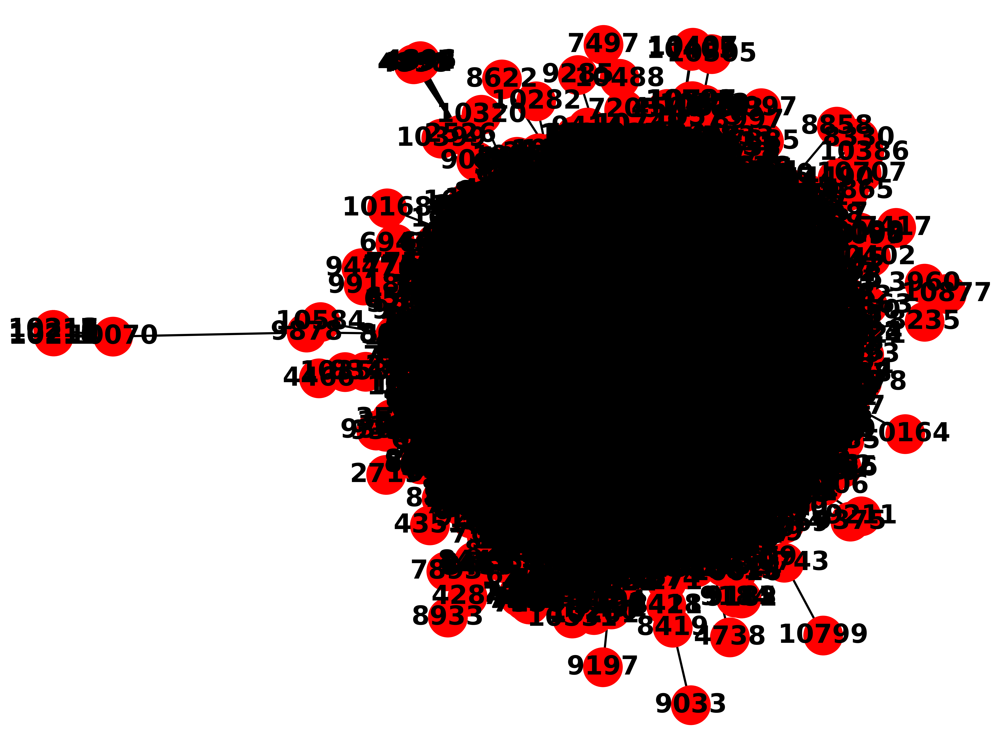
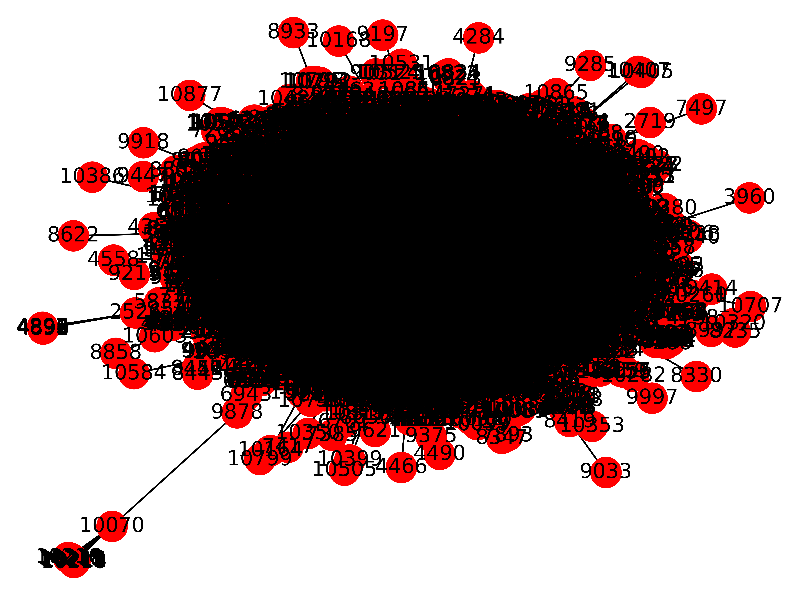

Gnutella peer-to-peer network
----------
A graph of the Gnutella peer-to-peer file sharing network 
Data source has been downloaded from http://snap.stanford.edu/data/p2p-Gnutella04.html

Initial data has been converted to gml format by Java program.

The aim of visualization:
1) find special nodes - with option directed 0

2) in undirectional case - it shows general picture of node’s relations 

Interactive vizualisation allow zoom in/out custom parts of graphs

Code has been developed by python libraries networkx and matplotlib 
