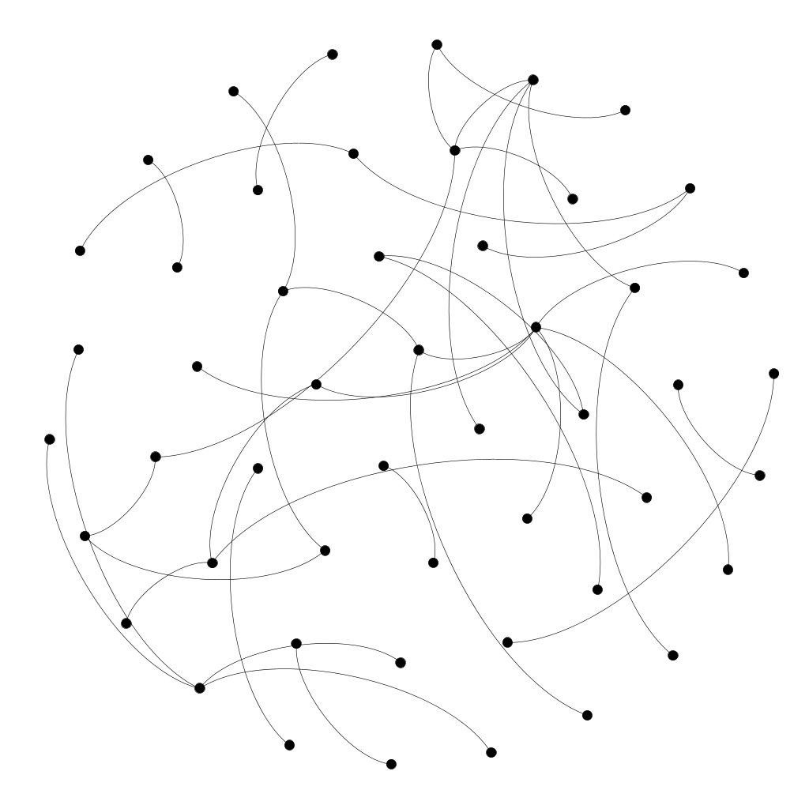

Gnutella peer-to-peer network
----------
A graph of the Gnutella peer-to-peer file sharing network 
Data source has been downloaded from http://snap.stanford.edu/data/p2p-Gnutella04.html

Initial data has been converted to gml format by Java program.

The aim of visualization - investigate of gnutella's nodes:

1) look at all nodes

On next step I got Top 100 by connections nodes:

and Top 1000 nodes by connections:

It seems that the nodes are distributed more or less evenly.

But, there is a center - node 3109 with 103 connected edges.

Summary by nodes edges:             
 Min.   :  1.000  
 1st Qu.:  2.000  
 Median :  5.000  
 Mean   :  7.355  
 3rd Qu.: 12.000  
 Max.   :103.000  
 
 Distributions of edges per node:
 